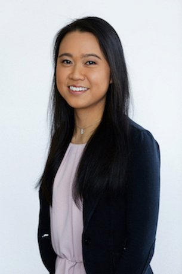

<link rel="stylesheet" href="styles.css" type="text/css">

I am an MD/PhD student at the [__Johns Hopkins School of Medicine: Medical Scientist Training/MD-PhD Program__](https://mdphd.johnshopkins.edu/).

My interests include: __precision dermatology__, __preventive medicine__, __public health__, __data science__, __machine learning__, and __digital health__.

I am currently performing research in computational medicine as part of the [__Hopkins Individualized Health Initiative__](https://www.hopkinsmedicine.org/inhealth/) and __NIH F30 Ruth L. Kirschstein National Research Service Award__ to improve disease prevention, diagnosis, and treatment through data science and predictive analytics. I completed my PhD in biomedical engineering with a focus on machine learning for clinical risk prediction, under the mentorship of [Dr. Scott Zeger](https://malonecenter.jhu.edu/people/scott-zeger/), the John C. Malone Professor of Biostatistics and Medicine.

Before starting my training as a physician scientist at Hopkins, I completed my undergraduate studies in bioengineering and biomedical research at the University of California, Los Angeles (UCLA). At UCLA, I also performed tissue engineering research in [Dr. Benjamin Wu’s lab](https://weintraubcenter.dentistry.ucla.edu/wu-lab) as a Howard Hughes Undergraduate Research Program Scholar and Goldwater Scholar.

Contact information: swongvi1 at jhmi dot edu

