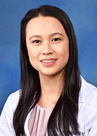

<link rel="stylesheet" href="styles.css" type="text/css">

I am a graduate of the [__Johns Hopkins School of Medicine: Medical Scientist Training/MD-PhD Program__](https://mdphd.johnshopkins.edu/), and I am currently a resident in the [__University of California, Los Angeles (UCLA) Specialty Training and Advanced Research (STAR) Program__](https://medschool.ucla.edu/star) and [__dermatology residency__](https://www.uclahealth.org/dermatology/residency-program).

My interests include: __precision dermatology__, __preventive medicine__, __public health__, __data science__, __augmented/artificial intelligence__, and __digital health__.

I am a recipient of the [__Dermatology Foundation: Dermatologist Investigator Research Fellowship__](https://dermatologyfoundation.org/rap/), and I am currently conducting research in [__Dr. Aydogan Ozcan's lab__]( https://www.ee.ucla.edu/aydogan-ozcan/) to improve the diagnosis and management of inflammatory skin diseases. Additionally, I serve on the [__American Academy of Dermatology (AAD) Augmented Intelligence Committee__](https://www.aad.org/) and the [__Society for Imaging Informatics in Medicine (SIIM) Enterprise Imaging Committee__](https://siim.org/membership/get-involved/committees/enterprise-imaging/).

Previously, I have performed research in computational medicine as part of the [__Hopkins Individualized Health Initiative__](https://www.hopkinsmedicine.org/inhealth/) to improve disease prevention, diagnosis, and treatment through data science and predictive analytics. With support from the [__NIH F30 Ruth L. Kirschstein National Research Service Award__](https://researchtraining.nih.gov/programs/fellowships/F30), I completed my PhD in biomedical engineering with a focus on machine learning for clinical risk prediction, under the mentorship of [__Dr. Scott Zeger__](https://malonecenter.jhu.edu/people/scott-zeger/), the John C. Malone Professor of Biostatistics and Medicine.

Before starting my training as a physician scientist at Hopkins, I completed my undergraduate studies in bioengineering and biomedical research at the University of California, Los Angeles (UCLA). At UCLA, I also performed tissue engineering research in [__Dr. Benjamin Wu’s lab__](https://weintraubcenter.dentistry.ucla.edu/wu-lab) as a Howard Hughes Undergraduate Research Program Scholar and Goldwater Scholar.

Contact information: swongvibulsin at mednet dot ucla dot edu
