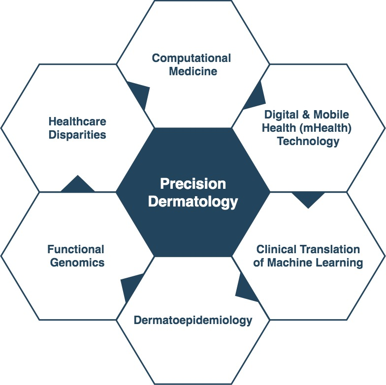

## 
## Research Areas

##
<!--## ## Current Projects

* __Machine Learning for Individualized COVID-19 Clinical Risk Prediction:__ under the advisement of Dr. Scott Zeger, PhD, Dr. Matthew Robinson, MD, Dr. Mei-Cheng Wang, PhD, and Dr. Brian Garibaldi, MD

* __Big Data, Machine Learning, and Digital Health Technology for Precision Dermatology:__ under the advisement of Dr. Shawn Kwatra, MD, Dr. Yevgeniy (“Eugene”) Semenov, MD, MA, and Dr. Scott Zeger, PhD !-->

##

<!--## Upcoming Presentation !-->

## Selected Prior Presentations
* __March 2024: [*The American Academy of Dermatology (AAD) Annual Meeting*](https://www.aad.org/member/meetings-education/am24):__ __Wongvibulsin S.__ *The 2024 Debates: Controversies in Dermatology - Artificial Intelligence (AI) in Dermatology*
* __May 2023: [*International Symposium on Artificial Intelligence in Dermatology at the International Societies For Investigative Dermatology Meeting (ISID)*](https://isid2023.org/):__ __Wongvibulsin S.__  *Enabling Precision Dermatology with Artificial Intelligence.* 
* __April 2021: [*Interurban Clinical Club*](http://interurbanclinicalclub.org/):__ __Wongvibulsin S.__  *Leveraging Big Data and Machine Learning for Clinical Risk Prediction.* 
* __May 2021: [*Society of Investigative Dermatology (SID) Virtual Meeting*](https://www.sidannualmeeting.org/):__ __Wongvibulsin S.__, Okoye G., Garza L. *Population-Level Study of Hidradenitis Suppurativa (HS) in the United States (US) Reveals Association with Obesity and Socioeconomic Status.* 

<!--## Manuscripts in Submission
* Ostovaneh M., Dodge A., Wu C., Tracy R., Liu K., Zeger S., McClelland R., __Wongvibulsin S.__, Shea S., Bluemke D, Lima J., Ambale-Venkatesh B. *Machine Learning to Predict Short-versus Long-term Cardiovascular Outcomes: Multi-Ethnic Study of Atherosclerosis.* !-->

##
## Publications

* __Wongvibulsin S.__, Yan M., Pahalyants V., Murphy W., Daneshjou R., Rotemberg V. [*Current State of Dermatology Mobile Applications With Artificial Intelligence Features.*](https://jamanetwork.com/journals/jamadermatology/fullarticle/2815800) JAMA Derm. 2024.

* Lee I., Aninos A., Lester J., Rotemberg V., Schlessinger D., Weed J., __Wongvibulsin S.__, Daneshjou R. [*Engaging industry effectively and ethically in artificial intelligence from the Augmented Artificial Intelligence Committee Standards Workgroup.*](https://doi.org/10.1016/j.jaad.2024.03.036) JAAD. 2024.

* Gui H., Rezaei S.,Schlessinger D., Weed J., Lester J., __Wongvibulsin S.__, Mitchell D., Ko J., Rotemberg V., Lee I., Daneshjou R. [*Dermatologists’ Perspectives and Usage of Large Language Models in Practice: An Exploratory Survey.*](https://pubmed.ncbi.nlm.nih.gov/38582369/) JID. 2024.

* __Wongvibulsin S.__ and Adamson A. [*Deep learning for Mpox: Advances, challenges, and opportunities.*](https://www.cell.com/med/pdf/S2666-6340(23)00134-4.pdf) Cell Press - Med. 2023.

* __Wongvibulsin S.__, Frech T., Chren M., Tkaczyk E. [*Expanding Personalized, Data-Driven Dermatology: Leveraging Digital Health Technology and Machine Learning to Improve Patient Outcomes.*](https://www.jidinnovations.org/article/S2667-0267(22)00012-1/fulltext) JID Innovations. 2022. 

* Kulkarni V., Okoye G., Garza L., __Wongvibulsin S.__ [*Geospatial Heterogeneity of Hidradenitis Suppurativa Searches in the United States: Infodemiology Study of Google Search Data.*](https://derma.jmir.org/2022/2/e34594) JMIR Derm. 2022.

* __Wongvibulsin S.__, Feterik K. [*Recommendations for Better Adoption of Medical Photography as a Clinical Tool: Viewpoint.*](https://www.i-jmr.org/2022/2/e36102) Interact J Med Res. 2022.

*	__Wongvibulsin S.__, Parthasarathy V., Pahalyants V., Murphy W., Sutaria N., Roh Y., Bordeaux, B., Deng J., Taylor M., Semenov Y., Kwatra S. [*Latent Class Analysis Identification of Prurigo Nodularis Comorbidity Phenotypes.*](https://onlinelibrary.wiley.com/doi/10.1111/bjd.20957) BJD. 2021.

* Sutaria N., Alphonse M., Marani M., Parthasarathy V., Deng J., __Wongvibulsin S.__, Williams K., Roh Y., Choi J., Bordeaux Z., Pritchard T., Dillen C., Semenov Y., Kwatra M., Archer N., Garza L., Dong X., Kang S., Kwatra S. [*Cluster analysis of circulating plasma biomarkers in prurigo nodularis reveals a distinct systemic inflammatory signature in African Americans.*](https://www.sciencedirect.com/science/article/pii/S0022202X21023836) JID. 2021.

* Knowles K., Xun H., Jang S., Pang S., Ng C., Sharma A., Spaulding E., Singh R., Diab A., Osuji N., Materi J., Amundsen D., __Wongvibulsin S.__, Weng D., Huynh P., Nanavati J., Wolff J., Marvel F., Martin S. [*Clinicians for CARE: A Systematic Review and Meta-Analysis of Interventions to Support Caregivers of Patients With Heart Disease.*](https://www.ahajournals.org/doi/10.1161/JAHA.120.019706) J Am Heart Assoc. 2021.

* Roh Y., Huang A., Sutaria N., Choi U., __Wongvibulsin S.__, et al. [*Real-world comorbidities of atopic dermatitis in the U.S. adult ambulatory population.*](https://www.sciencedirect.com/science/article/pii/S0190962221028383?via%3Dihub) JAAD. 2021.

* Bhardwaj V., Spaulding E., Marvel F., LaFave S., Yu J., Mota D., Lorigiano T., Huynh P., Shan R., Yesantharao P., Lee M., Yang W., Demo R., Ding J., Wang J., Xun H., Shah L., Weng D., __Wongvibulsin S.__, Carter J., Sheidy J., McLin R., Flowers J., Majmudar M., Elgin E., Vilarino V., Lumelsky D., Leung C., Allen J., Martin S., Padula W. [*Cost-effectiveness of a Digital Health Intervention for Acute Myocardial Infarction Recovery.*](https://journals.lww.com/lww-medicalcare/Abstract/9000/Cost_effectiveness_of_a_Digital_Health.98112.aspx) Med Care. 2021.

* Kalinich M., Murphy W., __Wongvibulsin S.__, Pahalyants V., Yu K., Lu C., Zubiri L., Naranbhai, V., Gusev A., Kwatra S., Reynolds K., Semenov Y. [*Prediction of severe immune-related adverse events requiring hospital admission in patients on immune checkpoint inhibitors: study of a population level insurance claims database from the USA.*](https://jitc.bmj.com/content/9/3/e001935) Journal for ImmunoTherapy of Cancer. 2021.

* __Wongvibulsin S.__, Sutaria N., Kannan S., Alphonse M., Belzberg M., Williams K., Brown I., Choi J., Roh Y., Pritchard T., Khanna R., Eseonu A., Jedrych J., Dillen C., Kwatra M., Chien A., Archer N., Garza L., Dong X., Kang S., Kwatra S. [*Transcriptomic analysis of atopic dermatitis in African Americans is characterized by Th2/Th17-centered cutaneous immune activation.*](https://www.nature.com/articles/s41598-021-90105-w) Scientific Reports. 2021. 

* __Wongvibulsin S.\*__, Pahalyants V.\*, Kalinich M., Murphy W., Yu K., Wang F., Chen S., Reynolds K., Kwatra S., Semenov Y. (\* these authors contributed equally) [*Epidemiology and risk factors for the development of cutaneous toxicities in patients treated with immune checkpoint inhibitors: A United States population-level analysis.*](https://www.jaad.org/article/S0190-9622(21)00661-7/fulltext) JAAD. 2021. 

* __Wongvibulsin S.__, Sutaria N., Williams K., Huang A., Choi J., Roh Y., Hong M., Kelley D., Pahalyants V., Murphy W., Alphonse M., Bakhshi P., Walia A., Semenov Y., Kwatra, S. [*A Nationwide Study of Prurigo Nodularis: Disease Burden and Health Care Utilization of Prurigo Nodularis in the U.S. Population.*](https://www.sciencedirect.com/science/article/pii/S0022202X21011301) JID. 2021. 

* Belzberg M., Alphonse M., Brown I., Williams K., Ho B., __Wongvibulsin S.__, et al. [*Prurigo Nodularis is Characterized by Systemic and Cutaneous Th22 Immune Polarization.*](https://www.sciencedirect.com/science/article/pii/S0022202X21010162?via%3Dihub) JID. 2021. 

* Marvel F., Spaulding E., Lee M., Yang W., Demo R., Ding J., Wang J., Xun H., Shah L., Weng D., Carter J., Majmudar M., Elgin E., Sheidy J., McLin R., Flowers J., Vilarino V., Lumelsky D., Bhardwaj V., Padula W., Shan R., Huynh P., __Wongvibulsin S.__, Leung C., Allen J., Martin S. [*Digital Health Intervention in Acute Myocardial Infarction*](https://www.ahajournals.org/doi/10.1161/CIRCOUTCOMES.121.007741) Circulation: Cardiovascular Quality and Outcomes. 2021. 

* __Wongvibulsin S.__, Garibaldi B., Antar A., Wen J., Wang M., Gupta A., Bollinger R., Xu Y., Wang K., Betz J., Muschelli J., Roche K., Zeger S., Robinson M. [*Development of Severe COVID-19 Adaptive Risk Predictor (SCARP), a calculator to predict severe disease or death in hospitalized patients with COVID-19.*](https://www.acpjournals.org/doi/10.7326/M20-6754) Annals of Internal Medicine. 2021.

* __Wongvibulsin S.__, Habeos E., Huynh P., Xun H., Shan R., Rodriguez K., Wang J., Gandapur Y., Osuji N., Shah L., Spaulding E., Hung G., Knowles K., Yang W., Marvel F., Levin E., Maron D., Gordon N., Martin S. [*Digital Interventions for Cardiac Rehabilitation: A Systematic Literature Review.*](https://www.jmir.org/2021/2/e18773/) JMIR. 2021.

* __Wongvibulsin S.__, Semenov Y., Khanna R., Zeger S., Kwatra S. [*Machine Learning (ML) Predictive Algorithm for Childhood-Onset Chronic Pruritic Dermatoses (CPD) Identifies Acrylamide and Glycidamide as Itch Modulators.*](https://www.jidonline.org/article/S0022-202X(20)31110-6/fulltext) JID. 2020.

* Wu K., __Wongvibulsin S.__, Tao S., Ashikaga H., Stillabower M., Dickfeld T., Weiss G., Tomaselli G., Zeger S. [*Baseline and Dynamic Risk Predictors of Appropriate Implantable Cardioverter Defibrillator Therapy: A Machine Learning Approach to Sudden Cardiac Death (SCD) Risk Prediction.*](https://www.ahajournals.org/doi/10.1161/JAHA.120.017002) JAHA. 2020.

* __Wongvibulsin S.__, Wu K., Zeger S. [*Improving Clinical Translation of Machine Learning Approaches Through Clinician-Tailored Visual Displays of “Black Box” Algorithms.*](https://medinform.jmir.org/2020/6/e15791/) JMIR Medical Informatics. 2020.

* Radin J., Peters S., Ariniello L., __Wongvibulsin S.__, Galarnyk M., Wallen J., Steinhubl S. [*Pregnancy Health in POWERMOM Participants Living in Rural versus Urban Zip Codes.*](https://doi.org/10.1017/cts.2020.33) Journal of Clinical and Translational Science. 2020.

* __Wongvibulsin S.__, et al. (all authors contributed equally) [*Artificial intelligence (AI) reflections in 2019.*](https://www.nature.com/articles/s42256-019-0141-1) Nature Machine Intelligence. 2020. 

* __Wongvibulsin S.__, Wu K., Zeger S. [*Random Forests for Survival, Longitudinal, and Multivariate (RF-SLAM) Data Analysis with Applications to Clinical Risk Prediction.*](https://bmcmedresmethodol.biomedcentral.com/articles/10.1186/s12874-019-0863-0) BMC Medical Research Methodology. 2019.

*	__Wongvibulsin S.__, Zeger S. [*Enabling individualized health in learning healthcare systems.*](https://ebm.bmj.com/content/25/4/125) BMJ Evidence-Based Medicine. 2019.

* Yang W., Shah L., Spaulding E., Wang J., Xun H., Weng D., Shan R., __Wongvibulsin S.__, Marvel F., Martin S. [*The Role of a Clinician Amidst the Rise of Mobile Health Technology.*](https://academic.oup.com/jamia/article/26/11/1385/5542898) JAMIA. 2019.

* Shah L., Yang W., Demo R., Lee M., Weng D., Shan R., __Wongvibulsin S.__, Spaulding E., Marvel F., Martin S. [*Technical guidance for clinicians interested in partnering with engineers in mHealth development and evaluation.*](https://mhealth.jmir.org/2019/5/e14124/) JMIR mHealth uHealth. 2019.

*	__Wongvibulsin S.__, Martin S., Saria S., Zeger S., Murphy S. [*An Individualized, Data-Driven Digital Approach for Precision Behavior Change.*](https://journals.sagepub.com/doi/full/10.1177/1559827619843489) The American Journal of Lifestyle Medicine. 2019. 

* __Wongvibulsin S.__ [*Fostering Diversity and Inclusion in the Machine Intelligence Community.*](https://www.ncbi.nlm.nih.gov/pmc/articles/PMC6687322/) Nature Machine Intelligence. 2019.

*	__Wongvibulsin S.__, Martin S., Steinhubl S., Muse E. [*Connected Health Technology for Cardiovascular Disease Prevention and Management.*](https://link.springer.com/article/10.1007/s11936-019-0729-0) Current Treatment Options. 2019. 

*	__Wongvibulsin S.__, Ho B., Kwatra S. [*Embracing machine learning and digital health technology for precision dermatology.*](https://www.tandfonline.com/doi/full/10.1080/09546634.2019.1623373) Journal of Dermatological Treatment. 2019. 

*	__Wongvibulsin S.__, Khanna R., Kwatra S. [*Anatomic localization and quantitative analysis of the burden of itch in the United States.*](https://www.sciencedirect.com/science/article/pii/S0190962219309934?via%3Dihub) JAAD. 2019.

*	Yang W., Spaulding E., Lumelsky D., Hung G., Huynh P., Knowles K., Marvel F., Vilarino V., Wang, J., Shah L., Xun, H., Shan, R., __Wongvibulsin S.__, Martin S.  [*Strategies for the Successful Implementation of a Novel iPhone Loaner System (iShare) in mHealth Interventions: Prospective Study.*](https://mhealth.jmir.org/2019/12/e16391/) JMIR mHealth uHealth. 2019.

*	Delva S., Waligora K., Cajita M., Koirala B., Shan R., __Wongvibulsin S.__, Vilarino V., Gilmore D., Han H. [*Efficacy of Mobile Health for Self-Management of Cardiometabolic Risk Factors: a Theory-guided Systematic Review.*](https://journals.lww.com/jcnjournal/Abstract/9000/Efficacy_of_Mobile_Health_for_Self_management_of.99321.aspx) JCN. 2019.

*	Shan R., __Wongvibulsin S.__, Martin S. [*How Partnerships Between Humans and Technology Can Enhance Health Care.*](https://www.consultant360.com/exclusive/cardiology/how-partnerships-between-humans-and-technology-can-enhance-health-care) Cardiology Consultant. 2018.  

*	__Wongvibulsin S.__, Daza E.J. (both authors contributed equally) [*Generating Actionable Insights: Machine Learning for Causal Inference with Individual-Level Patient Generated Data.*](https://static1.squarespace.com/static/59d5ac1780bd5ef9c396eda6/t/5b73799889858325de8d72da/1534294439268/Wongvibulsin_S.pdf) MLHC: Proceedings of Machine Learning Research. 2018. 

*	Wang J., __Wongvibulsin S.__, Henry K., Fujita S. [*Quantifying and Visualizing Medication Adherence in Patients Following Acute Myocardial Infarction.*](https://www.ncbi.nlm.nih.gov/pmc/articles/PMC5977657/) AMIA Annu Symp Proc. 2017.

*	__Wongvibulsin S.__, Vazirani, S., Li Z., Heber D. [*Vitamin D – Beyond Bones: Its Relationship to Obesity, Metabolic Syndrome, and Diabetes.*](https://www.ncbi.nlm.nih.gov/pmc/articles/PMC6513299/) J Nutritional Therapeutics. 2014.

*	__Wongvibulsin S.__, Lee S., Hui K. [*Achieving Balance Through the Art of Eating: Demystifying Eastern Nutrition and Blending it with Western Nutrition.*](https://www.ncbi.nlm.nih.gov/pmc/articles/PMC3943006/) J Traditional and Complementary Medicine. 2012.