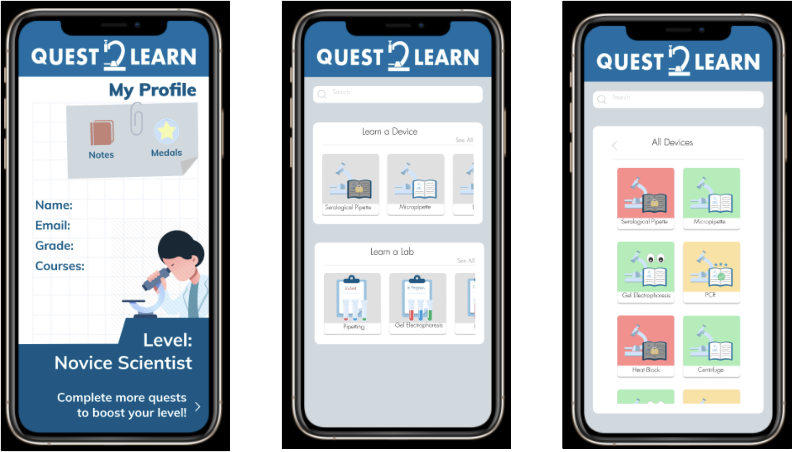

## *An Augmented Reality Approach to Biomedical Education*

To address the increasing impact of COVID-19 on education, I am part of a cross-disciplinary and cross-divisional collaborations between the Schools of Engineering, Arts and Sciences, Medicine, and Public Health to develop a “gamification” approach to education through the development of an augmented reality application to enhance both online and on-campus education at Johns Hopkins University and beyond. Our team has recently been awarded the [Digital Education & Learning Technology Acceleration (DELTA) Grant](https://provost.jhu.edu/about/digital-initiatives/delta/2021-delta-awards/). Learn more about our work [here](https://www.notion.so/Quest-2-Learn-Info-eb16a5657d9d41ff93c974c241db6ff8).

