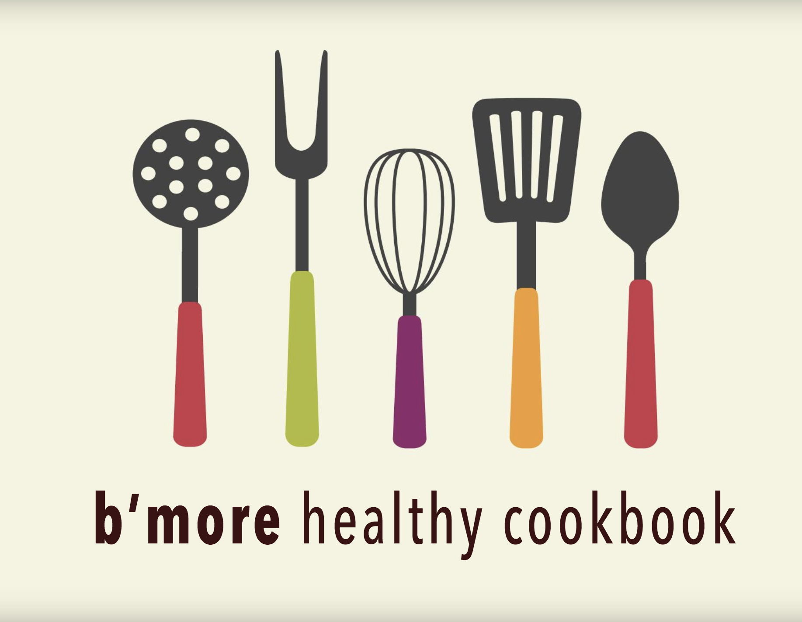
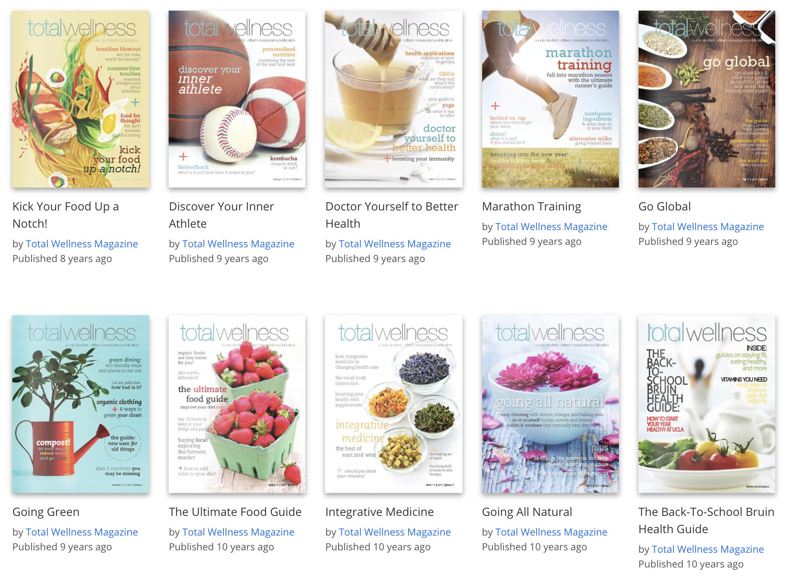

## __Nutrition & Culinary Medicine__

During my first year of medical school at Johns Hopkins, I established the __Nutrition in Medicine (NiM) Interest Group and the Teaching Kitchen__ to empower students with practical nutrition and culinary knowledge to counsel patients on healthy dietary practices.

We created the __B’more Healthy Cookbook__ to promote healthy eating in the Baltimore community. Our group was selected to participate in the 2015-16 cohort of __Johns Hopkins University’s Social Innovation Lab__ to develop community cooking and nutrition classes.

Click on the cookbook below to view the online version of the __B'more Healthy Cookbook__.

View our __Cooking and Learning Together__ video by clicking on the image below.

Learn more about our Teaching Kitchen initiative at the [__Lifestyle Medicine Education Collaborative__](https://lifestylemedicineeducation.org/johns-hopkins-university-school-of-medicine-teaching-kitchen/) and the [__*Journal of Nutrition Education and Behavior*__](https://www.jneb.org/article/S1499-4046(17)30388-3/fulltext).

## __Total Wellness Magazine__

As an undergraduate at UCLA, I served as the __director and editor-in-chief of *UCLA Total Wellness Magazine*__. You can read our publications [here](https://issuu.com/totalwellnessmagazine)! 

